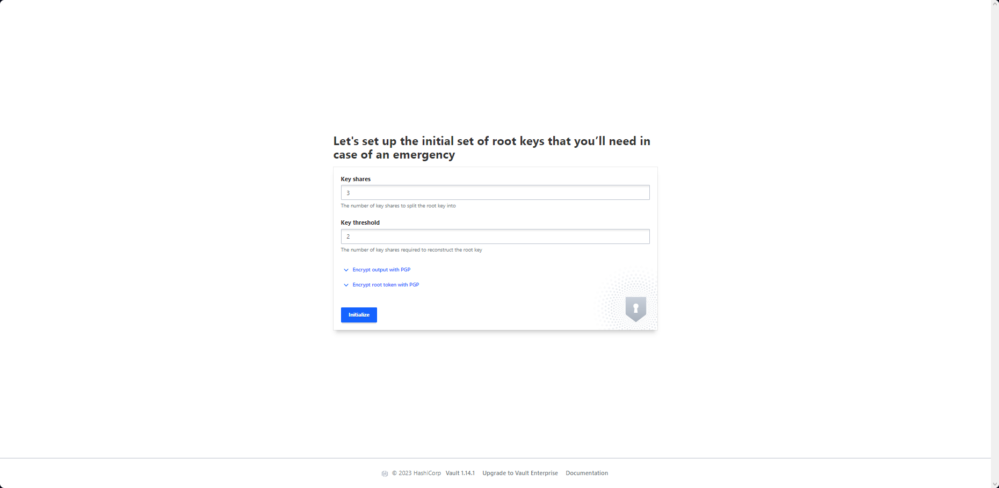

# Vault-Posgres

This is docker-compose for Hashicorp with Vault integration.
This repos is for exploring Hashicorp-Vault functionality with Postgres as its storage.

## Run

```sh
docker-compose up -d
```

**Warning:** This script use Initialization scripts functionality in postgres image. Scripts in ```/docker-entrypoint-initdb.d``` are only run if you start the container with a data directory that is empty; any pre-existing database will be left untouched on container startup. One common problem is that if one of your ```/docker-entrypoint-initdb.d``` scripts fails (which will cause the entrypoint script to exit) and your orchestrator restarts the container with the already initialized data directory, it will not continue on with your scripts.

If you always found error when running the containers, delete the volumes contains the db data which is **postgresdb**, and re-init docker compose using command:

```sh
docker-compose up -d
```

or run sql script on folder ```/sql``` manually to create the initiation database and tables.

## Access to PgAdmin

- URL: ``http://localhost:5050``
- Username: <pgadmin4@pgadmin.org> (as a default)
- Password: admin (as a default)

### Access Postgredb from PgAdmin

Add a new server in PgAdmin:

- Host name / address: ``postgresdb``
- Port: ``5432``
- Username as ``POSTGRES_USER``, by default ``postgres``
- Password as ``POSTGRES_PASSWORD``, by default ``passwordadmin``

## Vault Initialization

1. Access vault-ui in ``http://localhost:8200``

2. There will be form to setup Key shares and Key threshold. You can insert:

    - Key shares: ``3``
    - Key threshold: ``2``

    then click Initialize.

    For more information about this mechanisms you can read more about it [here](https://developer.hashicorp.com/vault/docs/commands/operator/init).

    

    After that, Vault will generate root_token and keys to unseal the vault in case Vault is re-sealed, restarted, or stopped. Download and save keys, make sure you will have access to view this keys later for un-sealing the vault later. Then, click ``Continue to Unseal``.

3. Then, the UI will show form to unseal Vault. Insert previous saved keys then click ``Unseal``. Do this 2 times with different keys.
    **Note:** Insert the ``keys_base64``.

4. After that, it will show the login form, select Method ``token`` and insert previously saved root_token to login.

5. You have successfully access Vault Management UI.

## Create and Access Secret (Key-Values)

**Official Documentation (Create and Access from CLI):** <https://developer.hashicorp.com/vault/tutorials/getting-started/getting-started-first-secret>

1. Enter the ``Secret Engine`` menu on sidebar, then click ``Enable new engine`` on the top right.

2. Choose ``KV`` then click ``Next``.

3. Enter ``Path`` with your intended value path (ex: ``my-secret``) then click ``Enable engine``.

4. You will enter page for your newly created secret path, then click ``Create secret``.

5. Enter ``Path for this secret``  with your intended value (ex: ``username-password``). Then insert your secret data. Example:

    ```json
    {
        "user": "my_user",
        "password": "my_password
    }

    ```

6. Then click ``Save``. Your secret is successfully created and ready to be accessed.

7. You can access this secret via API on ``http://localhost:8200/v1/my-secret/data/username-password``, you can use root token to be able access this secret.
